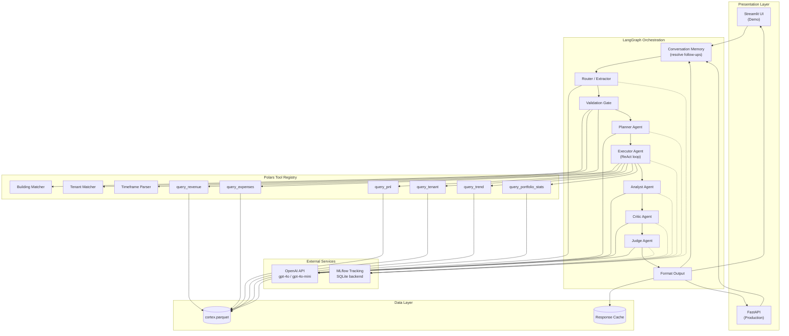
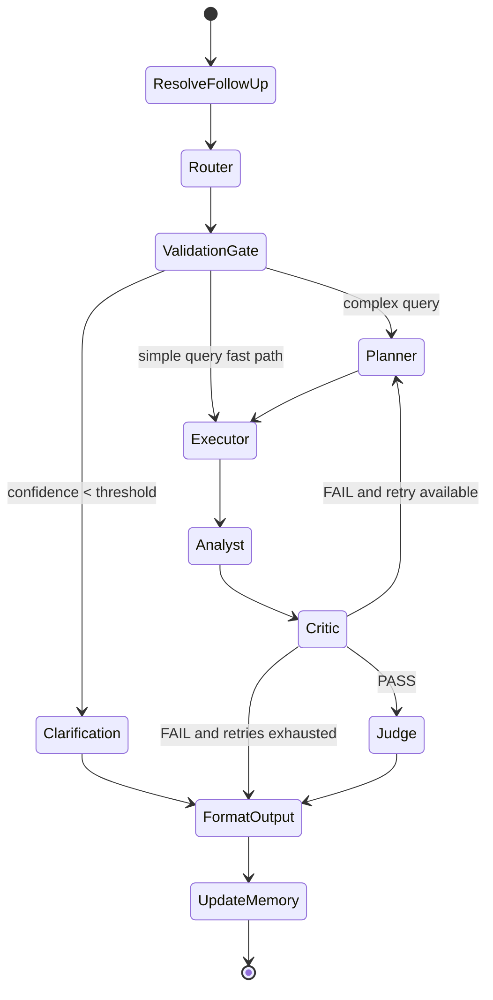
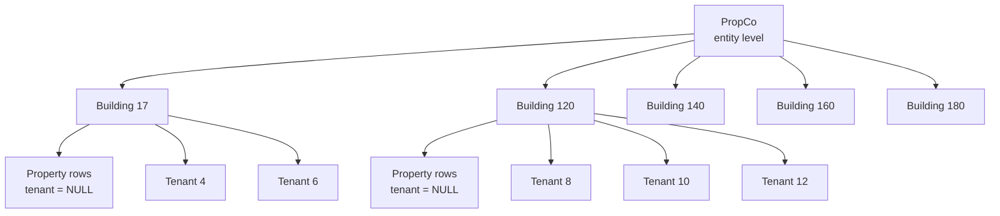

# Graph RAG Architecture

This document summarizes the system architecture described in `SPEC.md` and makes the main diagrams easier to find without searching through the full specification.

## Overview

The system is a LangGraph-based, multi-agent workflow for querying a Cortex real-estate ledger dataset with natural language.

Main architectural goals:
- keep data retrieval deterministic and Polars-backed
- keep reasoning on the backend side
- avoid aggregation-level mistakes and double-counting
- support follow-up questions through conversation memory
- make the pipeline observable through reasoning traces and metrics

Core layers:
- Presentation: `ui/streamlit_app.py` today, FastAPI in the production path
- Orchestration: LangGraph workflow in `src/graph/workflow.py`
- Agents: router, planner, executor, analyst, critic, judge
- Data access: Polars-backed query tools over `cortex.parquet`
- Configuration: `.env`-driven runtime settings via `src/utils/config.py`

## High-Level System Architecture

## Agent Flow

## Data Hierarchy

The Cortex dataset is hierarchical and queries must respect aggregation boundaries:

- Entity level: `property_name IS NULL AND tenant_name IS NULL`
- Property level: `property_name = X AND tenant_name IS NULL`
- Tenant level: `property_name = X AND tenant_name = Y`

This distinction is critical because property questions must not accidentally aggregate tenant rows unless the user explicitly asks for tenant analysis.

## Backend Reasoning Ownership

Reasoning is a backend concern.

Rules:
- `reasoning_trace` is created in backend workflow state
- the UI may render the trace but must not invent or reconstruct it
- each major node can append trace entries for debugging and observability

Relevant code:
- `src/graph/workflow.py`
- `src/graph/state.py`
- `src/agents/`

## Current Implementation Notes

The current implementation already follows these main directions:
- `.env` is the source of truth for runtime settings
- Python 3.12 is the supported environment baseline
- query tools use Polars over the parquet dataset
- tests validate routing, memory, planner behavior, and tool correctness

For delivery sequencing and rollout checklists, see `docs/implementation_plan.md`.
